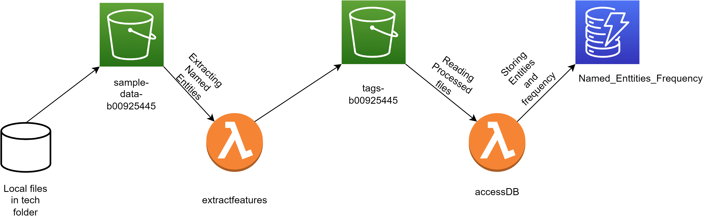

# AWS Event-Driven NLP Processor
## Event-Driven-Serverless-Application

## Overview

This project demonstrates a serverless architecture on AWS, integrating S3, Lambda, and DynamoDB for efficient text data processing. By leveraging AWS services, the solution sets a standard for cloud-based architecture.

## Skills and Deliverables

- Amazon S3
- AWS Lambda
- Amazon DynamoDB
- AWS Development
- NLP Tokenization
- Python
- Server
- Natural Language Processing

## Project Highlights

1. **S3 Bucket Setup**
   - Created "sample-data-B00925445" bucket with proper configuration and security settings.

2. **Lambda Functions**
   - Implemented "extractFeatures" to process Named Entities and generate JSON arrays.
   - Utilized "AccessDB" to update DynamoDB when new files are added to the "tags-B00925445" bucket.

3. **DynamoDB Integration**
   - Stored Named Entity data with key-value pairs, enhancing data management practices.

4. **Comprehensive Testing**
   - Rigorous testing for file upload, content validation, and successful processing and storage.

## Testing

Execute thorough test cases to ensure functional integrity.

## AWS Best Practices

By adopting AWS Lambda, S3, and DynamoDB, this serverless architecture ensures efficient, scalable, and cost-effective processing of Named Entity data, reflecting seamless integration for a cohesive and reliable event-driven workflow.
